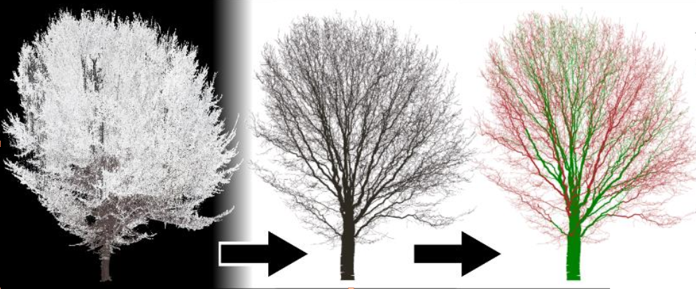
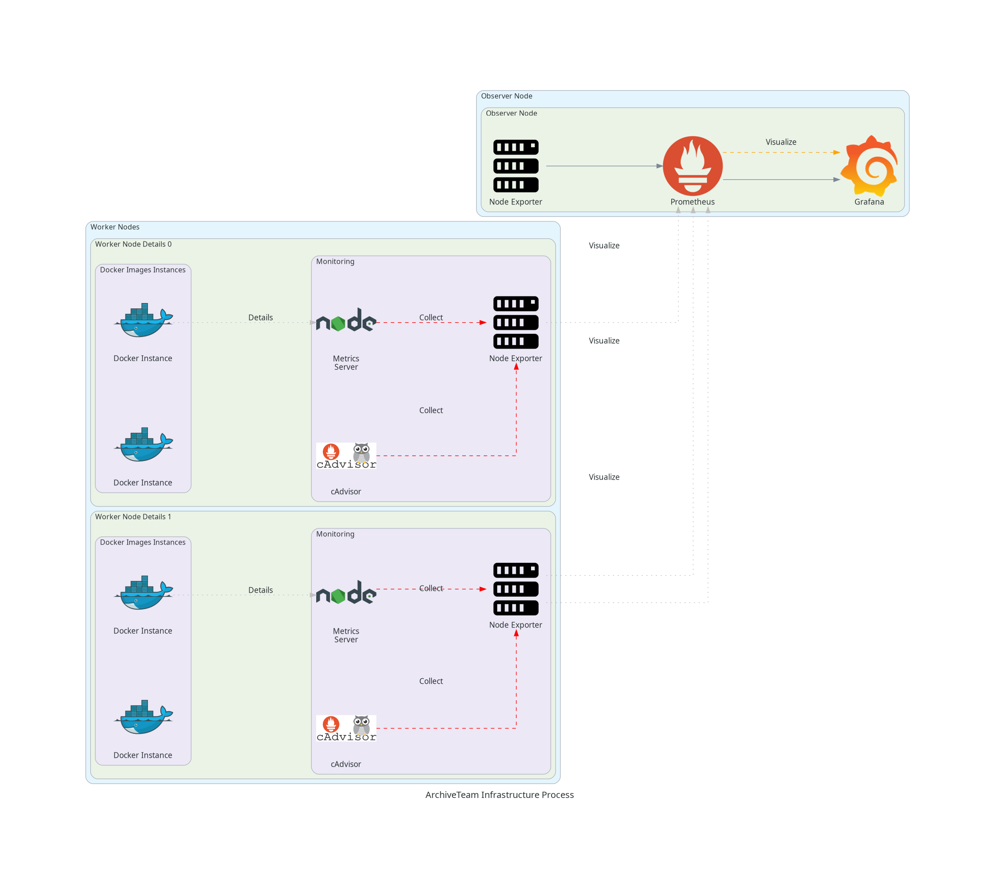
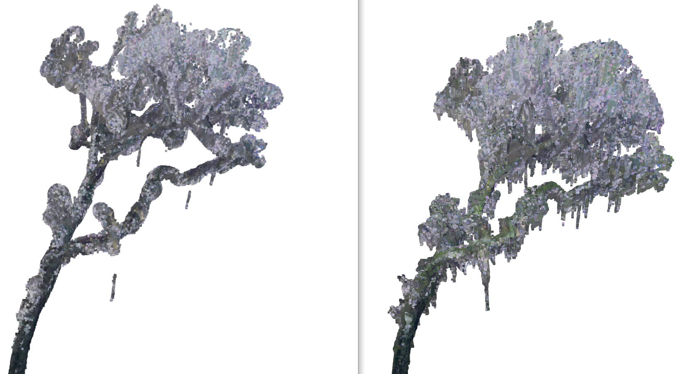

  

    
    
    
    
    
    
    
    
    
    
    
    
  

  📣 Have any questions? Please reach out!: 
  
  
  <!--  -->

-- 

I'm a **data engineer** and **environmental data enthusiast** passionate about empowering scientists with data. My key efforts focus on geospatial/remote sensing data analysis but I add value more generally through:
- the creation of data acquisition pipelines (REST/SOAP Apis, web scraping,...)
- implementation of lightweight CI/CD tooling
- orchestration and containerization of workflows (often leveraging IaC tools for reproducibility)

---
## 🔬 My Work at a Glance

> [!NOTE]
> Detailed project descriptions are available via dropdowns.

<h3>Infrastructure-as-Code & DevOps</h3>

 <b> Distributed Compute Observation Stack </b>- <a href=https://github.com/wischmcj/archiveteam-digitalocean-IaC> ArchiveTeam IaC </a> - <em>Prometheus, Grafana, NodeJS, Docker, Bash </em> 

    
Automated provisioning  and configuration of multi-container, multi-server clusters. Modular monitoring stack consists of n Observer nodes running Prometheus for node management/aggregation, pre-build Graphana dashboards for visualization and a custom a node.js metrics server for exporting both observer and worker telemetry.

 <b> Personal k3s Cluster (HomeLab) </b> - Pengualab IaC - <em> k3s, Helm, Ansible, Argo</em> 

 
 IaC for the configuration of a multi-architecture (ARM, x64), cross-OS cluster hosted on my local network. Used to configure nodes and deploy apps for my 'Homelab' - a collection of applications for personal use. 

### Geospatial & Remote Sensing

 <b> canopyHydrodynamics (Core) </b> - <em> NumPy, MatPlotLib, GeoPandas, GDAL </em> 

 
A production-grade Python package for simulating water movement through tree canopies using LiDAR derrived models and hydrolological techniques. Package is the subject of multiple research papers published in peer-reviewed journals for ecological research.

 <b> Object Detection MLOps </b> - <em> Laspy, PyTorch, Open3D </em> 

 
Pipeline for configuration and deployment of a convolutional neural-net on GPU-enabled, cloud-hosted clusters. A one-click solution enabling researchers without specialized hardware to process LiDAR data to rent compute 'as-needed'.

 <b> Point-based Segmentation + Simulation </b> - <em>SciPy, OpenCV, Rasterio </em> 

  
Image processing and spatial algorithms to clean and segment trees and their components within terrestrial LiDAR point clouds. Ray-casting + weather data used to estimate distribution of rain and sun exposure under a variety of meteorological conditions. 

<h3>Data Engineering </h3>

 <b> LinkedInScraper </b> - <em>DLT, Streamlit, DuckDB, Web Scraping </em> 

 
A LinkedIn data scraper and pipeline based on dlt - performs a series of scraping tasks, stages the results in DuckDB and surfaces them in a UI. Created by reverse engineering LinkedIn's 'hidden' Voyager API to automate data pulls.

 <b> canopyHydrodynamics (CI) </b> - <em> GitOps, Pandoc, PyPI </em> 

 
A published PyPI package with robust CI/CD workflow automation using GitOps principles. Workflows include automated linting and unit testing, documentation generation with Pandoc and PR-based, versioned deployment.

---

## 🚀 Featured Projects

### 🌳 [`canopyHydrodynamics`](https://github.com/wischmcj/canopyHydrodynamics)
A production-grade Python package for simulating water movement through tree canopies using LiDAR data and spatial hydrology models.

- Published to PyPI and cited in ecological research
- Extracts data for ecohydrological modeling utilizing only commonly used packages (NumPy, GeoPandas, NetworkX)
- Completed with robust CI/CD for testing, documentation automation and package publication

---

### 🌲 [`ArchiveTeam Observation Stack`](https://github.com/wischmcj/archiveteam-digitalocean-IaC)
Infrastructure-as-code that deploys a modern observability stack and an arbitrary number of containerized applications across several remote machines. Docker is used for containerization and the observation stack consists of a Prometheus, Grafana, and a custom NodeJS metrics server. Utilized primarily for the community archive project [ArchiveTeam](https://wiki.archiveteam.org/) 

- Creates and configures observer and worker nodes on digital ocean droplets using OpenTofu, Ansible
- Configurable, enabling a dynamic number of: workers (e.g. droplets) within the cluster and containers within each worker

---

### ⚡ [`PenguaLab-IaC`](https://github.com/wischmcj/PenguaLab-IaC)
Infrastructure-as-code setup for deploying a variety of homelab software containers on a Kubernetes (k3s) cluster using Terraform, Ansible, and Helm.

- Built to support a distributed home architecture for running parallel modeling processes 
- Entirely defines my home network as code, allowing me to host a resilient but flexible suite of always-available tooling
---

### 🔄 [`ml_ops_tree_learn`](https://github.com/wischmcj/ml_ops_tree_learn)
A small MLOps tool for cloud deployment of the Tree Learn Unet model. Automated provisioning of Digital Ocean GPU droplets to allow for accessible CUDA friendly compute.

- Emulates workflows I use professionally for model delivery
- Exemplifies the power of ML Ops when combined with open-source ML research

---

### 🕸️ [`linkedInScraper`](https://github.com/wischmcj/linkedInScraper)
A DLT pipeline for pulling jobs for followed companies from LinkedIn. Likewise contains a Node app for automating the application to jobs in a list curated by the user.

- Showcases utility scripting and automated data collection
- Represents my knack for building tools to bridge information silos

---

### 🌲 [`pyQSM`](https://github.com/wischmcj/pyQSM)
An under-development tool for processing terrestrial LiDAR scans; combining ML and procdedural techniqes for two main purposes
  1. **Tree Isolation**: Separating individual trees from surrounding man-made objects and other vegetation
  2. **Tree Segmentation**: Isolating and analyzing different parts of trees (trunk, branches, leaves) for structural modeling

Built with Open3D, PyTorch, and mesh processing libraries

---

## 🎯 What Drives Me

I'm deeply motivated by work that sits at the intersection of **data science**, **ecological systems**, and **open innovation**. Moreover, I strive to embody the principles of 'data-as-a-service' in my work - keeping my focus on the end users and the value my tools might provide.

---

📫 Feel free to connect with me:  
[LinkedIn](https://www.linkedin.com/in/collin-wischmeyer-b55659a4) • [GitHub](https://github.com/wischmcj) • cjwischmeyer@gmail.com  
