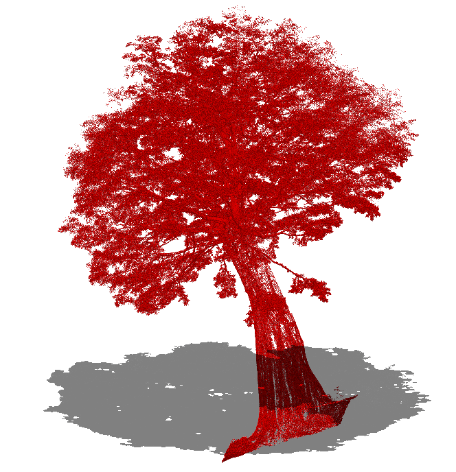
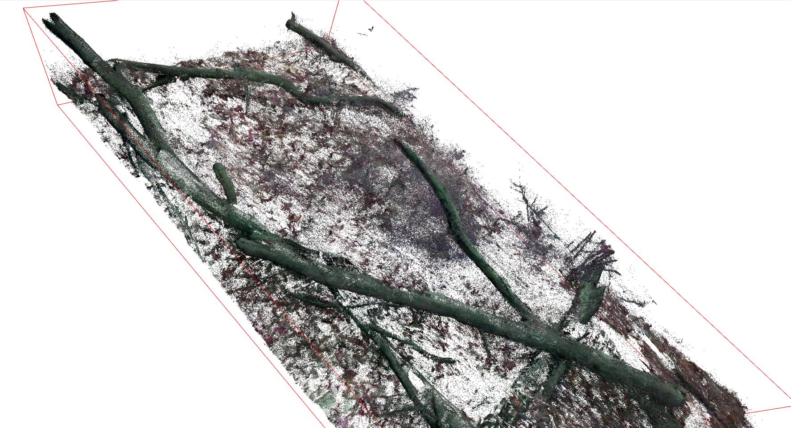
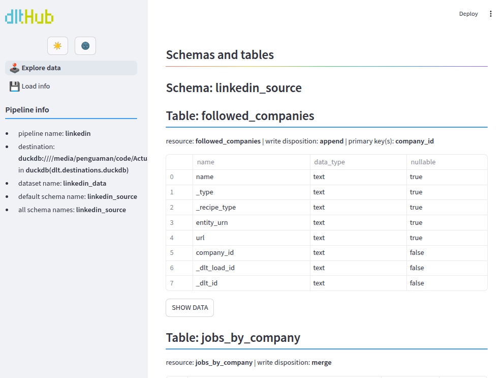

# Collin Wischmeyer 
<!--  -->

I'm a **data engineer** and **environmental data enthusiast** passionate about empowering scientists with data. My largest side projects focus on 
- Remote sensing data analysis and publishing related research 
- Using infrastructure-as-code tools for the orchestration and containerization of workflows
- Webscraping and archiving

📫 Questions? Connect with me at:  
[LinkedIn](https://www.linkedin.com/in/collin-wischmeyer-b55659a4) • cjwischmeyer@gmail.com  

## 🔬 Projects at a Glance
| Section                              | Technologies                                                                 | Project                                                                                      |
|---------------------------------------|-------------------------------------------------------------------------|--------------------------------------------------------------------------------------------------|
| **Infrastructure-as-Code**   | *Ansible, Terraform, Bash*                        | **ml_ops_tree_learn**: [Object detection MLOps](#-ml_ops_tree_learn) |
|  | *Prometheus, Grafana, NodeJS, Docker*                 | **ArchiveTeam IaC**: [Distributed compute observation stack](#-archiveteam-observation-stack) |
| **Geospatial & Remote Sensing**       |  *Open3D, PyTorch, OpenCV, Rasterio*               | **pyqsm**: [Image processing and spatial algorithms](#-pyqsm) |
|      | *NumPy, MatPlotLib, GeoPandas, GDAL*                   |  **canopyHydrodynamics**: [Simulating water movement within tree canopies](#-canopyhydrodynamics) |
| **Data Engineering / DevOps**         | *DLT, DuckDB, Web Scraping, Streamlit*                            | **LinkedInScraper**: [Automated data acquisition](#%EF%B8%8F-linkedinscraper)                         |
|    | *GitOps,  Pandocs, PyPI*                     |  **canopyHydrodynamics**: [Robust GitOps CI/CD workflows ](#-canopyhydrodynamics) 
|
|    | *Redis, Asyncio, Event-streaming*                            | **SimpleCrawler**: [CLI tool for site mapping w/ ayncronous io ](#-simple-crawler)     
Redis, Asyncio, Event-streaming

## 🚀 Featured Projects

> [!NOTE]
> Detailed project descriptions are available via dropdowns.

### 🌳 [`canopyHydrodynamics`](https://github.com/wischmcj/canopyHydrodynamics)
<em> GitOps, NumPy, MatPlotLib, GeoPandas, GDAL, Pandocs, PyPI </em>

  
 Simulating water movement within tree canopiea under varied meteorological conditions.
 

Identifies key structural traits:
<ul>
  <li> Stemflow and throughfall generating areas of the canopy
  </li>
  <li> The 'drip points' to which throughfall is directed - complete with their relative volumes
  </li>
  <li> 'Divides' and 'confluences' within the canopy that dictate the flow of water through the canopy
  </li>
</ul> 

  
Leverages GitOps for robust CI/CD capabilities.

<ul>
<li> automated linting and testing for all changes
</li>
<li> dynamically created version upgrade branches
</li>
<li>auto-generated method documentation 
</li>
<li>Versioned deployment automated for release branches </li>
</ul>

---

### 🌲 [`ArchiveTeam Observation Stack`](https://github.com/wischmcj/archiveteam-digitalocean-IaC)
<em>Prometheus, Grafana, NodeJS, Docker, Bash</em>

  
Infrastructure-as-code to provision and configure a multi-server, multi-container cluster with a modern observability stack. Utilized for the community archive project <a href="https://wiki.archiveteam.org/">ArchiveTeam</a>.

Consists of:
<ul>
  <li>
    Docker containerization monitored by CloudWatch
  </li>
  <li>Prometheus for node management/aggregation
  </li>
  <li>Graphana dashboards for visualization
  </li>
  <li>a custom a node.js metrics server for exporting telemetry. 
  </li>
</ul>

---

### 🌲 [`pyQSM`](https://github.com/wischmcj/pyQSM)
<em>SciPy, Open3D OpenCV, Rasterio </em> 

  
Image processing and spatial algorithms to clean and segment trees and their components within terrestrial LiDAR point clouds.

 
</ul>
Key functionality includes:
<li>Tree Isolation: Separating individual trees from surrounding man-made objects and other vegetation.
</li>
<li>Epiphyte Segmentation: Isolating and analyzing different parts of trees (trunk, branches, leaves) as well as plants in and around the trees.
</li>
<li>Ray Casting Similations: Creation of 3D meshes representing objects and examining their characteristics via tensor intersection calculations.
</li>
</ul>

---

### 🔄 [`ml_ops_tree_learn`](https://github.com/wischmcj/ml_ops_tree_learn)
<em> Laspy, Terraform, PyTorch, Open3D </em>

  
  An MLOps pipeline for configuration and deployment of a convolutional neural-net on GPU-enabled, cloud-hosted clusters.

 
  Automates the provisioning of Digital Ocean GPU droplets to allow users to leverage CUDA friendly compute. Designed as a 'one-click' solution enabling researchers without specialized hardware to process LiDAR data at minimal cost. 

--

###  [`SimpleCrawler`](https://github.com/wischmcj/simple-crawler)
<em> Redis, Asyncio, Event-streaming </em> 

  
A CLI tool for comprehensive website mapping. Producer/consumer architecture facilitated by Redis enables asyncronous, non-blocking io.

 
<ul>
  <li> Recurses web pages collecting 1. internal links 2. elements matching provided regez patterns
      </li>
  <li> Independently scalable worker pools 
    <ul>
      <li> `SiteDownloader`s: Consume urls from queue, requesting and caching html content
      </li>
      <li> `Parser`s: Identify requested elements in cached html, queue new urls for download, fire 'work-item-complete event.
      </li>
      <li> `UrlBulkWriter`s: Subscribe to completed item queue, batch write to SQL DB.
      </li>
    </ul> 
    </li>
  </li>
</ul>

---

### 🕸️ [`linkedInScraper`](https://github.com/wischmcj/linkedInScraper)
<em>DLT, DuckDB, Web Scraping, Streamlit </em> 

  
A DLT pipeline leveraging a LinkedIn's 'hidden' Voyager API to retrieve job and company data.

 
<ul>
  <li>Built on DLT which provides a UI for viewing pipeline status, exploring data
  </li>
  <li>Custom DLT source automatically handles REST requests, pagination, data extraction and relational DB storage
  </li>
  <li>Predefined endpoints/available datasets
    <ul>
      <li> `get_companies`: scrape followed companies via GraphQL profile components
      </li>
      <li> `get_job_urls`: fetch job cards per company
      </li>
      <li> `get_descriptions`: fetch job descriptions and details
      </li>
    </ul> 
    </li>
  <li> Extensible, with additional resources configured via json
  </li>
</ul>

